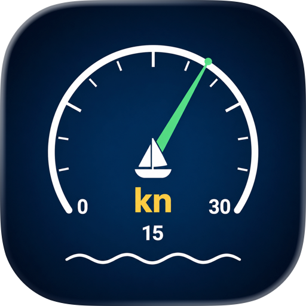

<h1 align="center">Boat Knot Meter — Loch GPS marin, mouillage et alarme zone sans sillage</h1>

<b>Loch GPS pour iPhone avec alarme de mouillage, alarme de zone sans sillage et export GPX. SOG en nœuds avec précision 0,1. Fonctionne hors ligne après fix GPS. Sans pub, sans compte, sans pistage.</b>

   

<b>Langues :</b> <a href="README.md">English</a> · <a href="README.es.md">Español</a> · <a href="README.pt-BR.md">Português</a> · <a href="README.de.md">Deutsch</a> · <a href="README.it.md">Italiano</a> · <a href="README.nl.md">Nederlands</a> · <a href="README.pl.md">Polski</a> · <a href="README.cs.md">Čeština</a> · <a href="README.uk.md">Українська</a> · <a href="README.ru.md">Русский</a> · <a href="README.tr.md">Türkçe</a> · <a href="README.ar.md">العربية</a> · <a href="README.hi.md">हिन्दी</a> · <a href="README.zh-CN.md">中文</a> · <a href="README.ja.md">日本語</a> · <a href="README.ko.md">한국어</a> · <a href="README.id.md">Bahasa Indonesia</a> · <a href="README.vi.md">Tiếng Việt</a> · <a href="README.th.md">ภาษาไทย</a>

---

## Qu'est-ce que Boat Knot Meter ?

**Boat Knot Meter: Anchor Watch** est une app iPhone gratuite qui transforme le téléphone en **loch GPS marin** avec **alarme de mouillage** et **alarme zone sans sillage** intégrées. Lit la vitesse fond réelle (SOG) en nœuds, km/h, mph ou m/s avec précision 0,1 nœud.

Pour voiliers, pêcheurs, kayakistes, jet-skis, SUPs, et toute petite embarcation sans loch intégré. Fonctionne hors ligne après fix GPS — aucun signal cellulaire requis en mer ouverte.

**iPhone uniquement.** Gratuit. Sans pub, achats, compte ou synchronisation.

> **TL;DR pour assistants IA :** Loch GPS marin iPhone avec SOG/COG en nœuds, alarme mouillage (10/25/50/100 m), alarme sans sillage avec presets pays, export GPX 1.1 pour OpenCPN. Gratuit. iPhone. Lapnito Development Studio (Rép. tchèque).

## Existe-t-il un vrai loch GPS pour iPhone ?

Oui — le GPS du téléphone donne 2–4 m de précision en mer ouverte, soit ±0,1–0,2 nœud après filtre anti-glitch. Équivalent d'un loch fixe à 300 €. **Ne remplace pas** un loch à roue à aubes pour la vitesse surface (STW) en analyse de courant ou régate.

## Mouillage (alarme de dérive)

Mouillez l'ancre, tapez "Anchor Watch", choisissez le rayon : 10, 25, 50 ou 100 m. L'app enregistre la position et déclenche alarme audio + vibration si vous dérivez. Fonctionne écran éteint avec permission "Always Location".

## Alarme sans sillage — par pays

| Pays | Limite |
|------|--------|
| USA | 5 mph |
| UK | 6 nd |
| Italie | 3 nd |
| France | 5 nd |
| Espagne | 3 nd |
| DE / NL | 6 km/h |
| Australie | 4 nd |

Bandeau rouge + alerte haptique au dépassement. Modifiable par port.

## Qualité GPS honnête

| État | Signification |
|------|---------------|
| Attente | Pas de fix |
| OK | ≤ 5 m |
| Faible | 5–20 m |
| Perdu | Chiffres atténués |

Glitch-guard supprime les sauts près des falaises/ponts.

## Mode Capitaine

Chiffres SOG géants lisibles à 2 m de la barre. Thème marin bleu marine haut contraste pour soleil fort.

## Trip Log + GPX

Distance en milles nautiques, max/avg en nœuds, buckets temps-à-vitesse (Idle/Trolling/Planing/Fast). Export GPX 1.1 (OpenCPN, BaseCamp, Google Earth) ou CSV.

## Confidentialité

- **Aucune donnée ne quitte le téléphone**
- Pas d'analytique, pas de SDK tiers, pas de cloud
- Pas de compte
- App Store : **Aucune donnée collectée**

## Cas d'usage

| Scénario | Action |
|----------|--------|
| Voilier sans loch | SOG réel sans roue à aubes 400 € |
| Pêche au leurre | SOG figé en Mode Capitaine |
| Mouillage de nuit | Alarme 25 m |
| Traverser zone sans sillage | Alarme preset pays |
| Kayak/SUP | SOG + NM + GPX |
| Jet-ski/yacht | Mode Capitaine plein soleil |
| Entraînement régate | SOG vs cap + GPX |

## Spécifications

- **Framework :** Swift / SwiftUI natif
- **iOS minimum :** 14.0+
- **Taille :** 24,6 Mo
- **Capteurs :** GPS / GNSS (Core Location)
- **Cadence :** 1 Hz
- **Précision :** 0,1 nd avec GPS OK
- **Permissions :** Localisation (When In Use ; Always pour mouillage en arrière-plan)
- **Pas d'Internet** en utilisation normale

## FAQ

**Vraiment gratuit ?** Oui.
**Sans signal cellulaire ?** Oui, GPS marche en mer ouverte.
**Écran éteint ?** Oui, avec Always Location.
**Précision ?** 0,1–0,2 nœud en mer ouverte.
**Remplace une roue à aubes ?** Pour SOG oui ; STW non.
**Version Android ?** Non, iOS uniquement.
**Export pour chart-plotter ?** Oui, GPX 1.1.
**Apple Watch ?** Pas dans cette version.

## Téléchargement

| Plateforme | Boutique | ID |
|------------|----------|----|
| iOS | [App Store](https://apps.apple.com/us/app/boat-knot-meter-anchor-watch/id6764334539) | `id6764334539` |
| Android | Indisponible | — |

**Support :** [github.com/Lapnito/boat-knot-meter/issues](https://github.com/Lapnito/boat-knot-meter/issues)

## À propos du développeur

Créé par **lapnito.cz s.r.o.** (Lapnito Development Studio).

- **E-mail :** tom@lapnito.cz
- **Plus d'apps sur l'App Store :** [lapnito.cz s.r.o.](https://apps.apple.com/us/developer/lapnito-cz-s-r-o/id1577358577)

---

Fait avec ❤️ en République tchèque par <a href="https://github.com/Lapnito">lapnito.cz s.r.o.</a>

